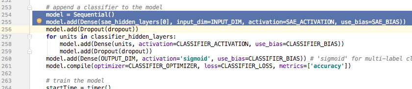
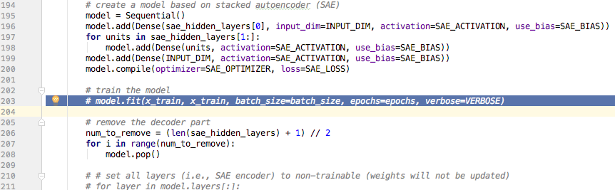
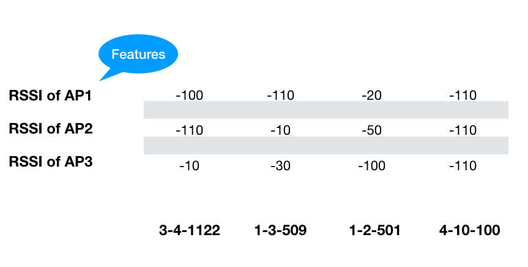
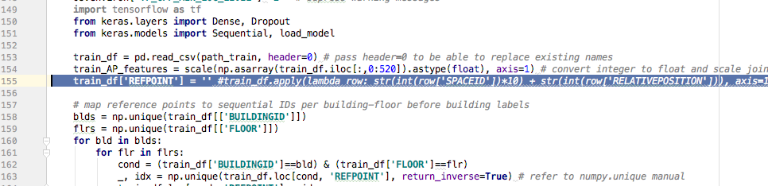
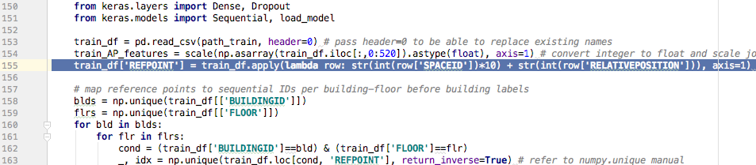
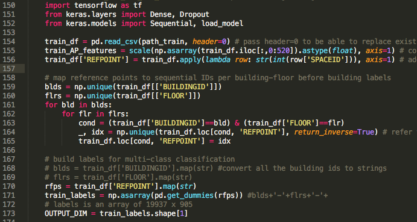
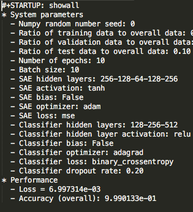

# Deep Neural Network-BasedWi-Fi Fingerprinting

## Introduction

* Indoor localization is a challenging task and there exist no universal solution
* However, in practical applications building floor plans can be often gathered prior to the operation of the localization system.

## Flow

* Load data
* Stacked Auto Encoder
* Classifier Network
* Evaluating the model

## Find the Bug

* Find the bug at beginning days
* The accuracy from %10 to %60

## Adjust Parameters

* epochs
* batch_size
* sae_hidden_layers
* classifier_hidden_layers
* training_validation_test_ratio
* dropout

### Example

* classifier_hidden_layers
* From 128,256,512 to 256,512,1024
* From 60% to 66%

## Touch the code

* Learn by hacking
* Remove SAE (Part 1)
* Increase Classification Layer(Part 2)
* Remove Building and Floor(Part 2)
* Remove Location(Part 2)

### Remove SAE

### About the fundamental problem

* Forget about the source code, what’s the original problem
* Input of 520 RSSI of APs
* Classification of Building Floor and Location(Space ID and Relative Position) combination

### Remove Location

### Remove BUILDING ID 
and FLOOR

* This is a Guess
* Location = Space ID + Relative Location
* What if the Space ID means “Room ID”
* Room ID should imply the BUILDING ID and FLOOR

From the previous two tests
It’s showing that Location is the BOTTLE NECK

## Loss function

* As all digital parameters were changed
* Loss function remains
* https://keras.io/losses/

## Conclusion

* All normal participants, but the Team is a hero
* Getting familiar with DeepLearning/TF/Keras in a short period
* Dig into basic classification knowledge
